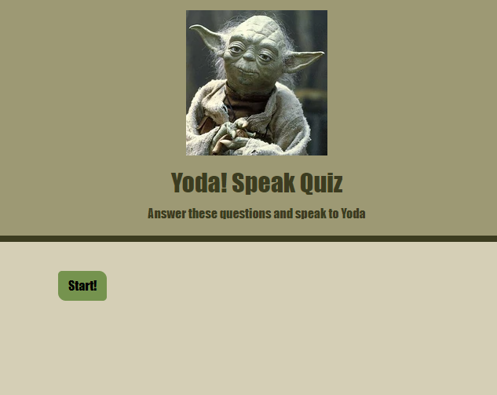

# Yoda_Speak_Quiz

## Description

Our motivation for the project is to provide our customer with user data while providing the user entertainment. Something short, easy and fun for the user allows our customer a way to collect useful information.
The project allows customers to collect the user’s data for marketing and research purposes. Also, provides users a chance to know what Yoda has to say about them based on their input.
While creating the project the team learned more about using multiple APIs at the same time while also applying/expanding our current knowledge of Bootstrap, Jquery and vanilla Javascript.

## Installation

Open a web browser and follow the link https://tibegex.github.io/Yoda_Speak_Quiz/.

## Usage

Press Start!

Answer the questions to find out what Yoda thinks!

## Credits

Joshua Lee- https://github.com/Tibegex

Kevin Wesley- https://github.com/KevinJWesley

Mason Weiner- https://github.com/masonweiner

Tarik Maggio- https://github.com/jodamagg

## APIs Used:

https://funtranslations.com/api/yoda

https://dog.ceo/dog-api/

https://aws.random.cat/
